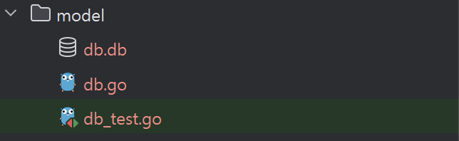

### go-sysinfo
```go
// installment method
go get github.com/elastic/go-sysinfo
```
- 프로그램 설치
- refer : https://pkg.go.dev/github.com/elastic/go-sysinfo
- git : https://github.com/elastic/go-sysinfo
- go-sysinfo는 시스템 정보를 수집하기 위한 라이브러리입니다. 이 라이브러리는 호스트 머신에 대한 정보와 호스트에서 실행 중인 프로세스에 대한 정보를 포함합니다.
- go-sysinfo를 사용하면 CPU, 메모리, 디스크, 네트워크 인터페이스 등 다양한 시스템 정보를 쉽게 가져올 수 있으며, 이를 통해 시스템 상태를 모니터링하거나 로그를 남기는 등의 작업을 수행할 수 있습니다.


### sqlite3 (New)
- refer : https://pkg.go.dev/modernc.org/sqlite#section-readme

```go
go get modernc.org/sqlite
```

### wmi 
- refer : https://github.com/yusufpapurcu/wmi
- go get github.com/yusufpapurcu/wmi
- 누군지 모르겠지만 친절하게 구현해놓음 굳


-----
## 삭제됨 
### sqlite3 (삭제됨 : 크로스 컴파일을 지원을 안함)
- go get github.com/mattn/go-sqlite3

First of all check CGO_ENABLED value: ```go env CGO_ENABLED```
Then try to update it using: ```go env -w CGO_ENABLED=<0 or1>```

- go env -w CGO_ENABLED=1

Second, you have installed gcc in golang
- refer :  https://medium.com/@yaravind/go-sqlite-on-windows-f91ef2dacfe
- if you have error that is ```exec: "gcc": executable file not found in %PATH%```, will follow refer method
  

- cleanup : go clean -i -v -x github.com/mattn/go-sqlite3